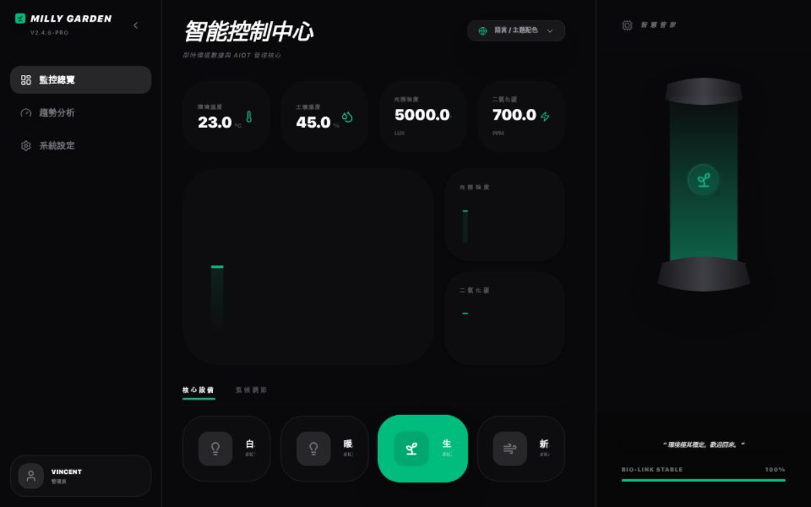

# Milly Garden Dashboard 🌱

一個用於智慧花園管理的互動式儀表板（例如，可以監控溫度、溼度、光照）。

# 專案截圖


## 🚀 線上預覽 (Demo)

點選這裡訪問部署好的網站：[https://milly-garden-dashboard.vercel.app](https://milly-garden-dashboard.vercel.app)
中國內地訪問網站：[https://milly-garden-dashboard.zeabur.app](https://milly-garden-dashboard.zeabur.app/)

## ✨ 主要功能 (Features)

*   **實時資料**：顯示溫度、溼度、光照等感測器資料。
*   **美觀介面**：使用 `recharts` 和 `lucide-react` 構建的現代化 UI。
*   **響應式設計**：支援在不同裝置上檢視。

## 🛠️ 技術棧 (Tech Stack)

*   **框架**：React.js (with Vite)
*   **語言**：TypeScript
*   **UI 元件**：Tailwind CSS (如果使用)
*   **圖表庫**：Recharts
*   **圖示**：Lucide React

## 📦 本地執行步驟 (Installation)

如果你想在本地執行這個專案，請按照以下步驟操作：

**先決條件**：確保已安裝 [Node.js](https://nodejs.org) 和 [Git](https://git-scm.com)。

1.  **克隆倉庫**：
    ```bash
    git clone https://github.com/chimingliao/milly-garden-dashboard.git
    ```
2.  **進入專案目錄**：
    ```bash
    cd milly-garden-dashboard
    ```
3.  **安裝依賴**：
    ```bash
    npm install
    # 或者使用 yarn install
    ```
4.  **啟動開發伺服器**：
    ```bash
    npm run dev
    # 或者使用 yarn dev
    ```
    應用將在 `http://localhost:5173` 執行。

## 📝 許可證 (License)

本專案採用 MIT 許可證，詳情請檢視 `LICENSE` 檔案。

---
<div align="center">
  由 chimingliao 維護
</div>
